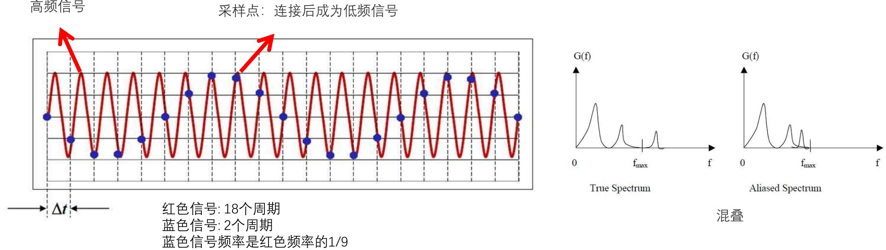
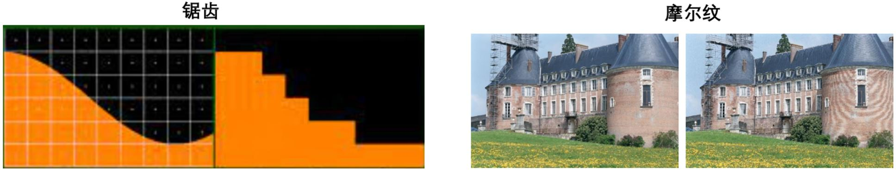
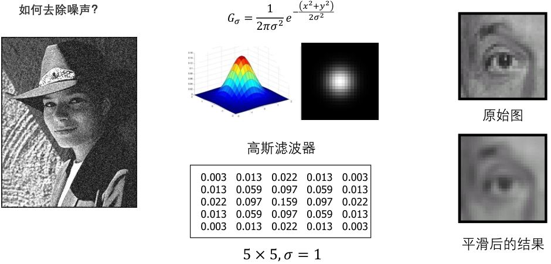
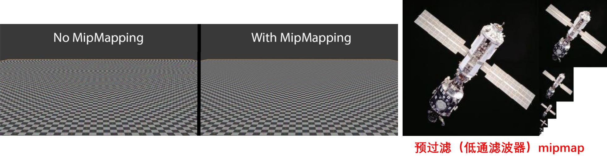
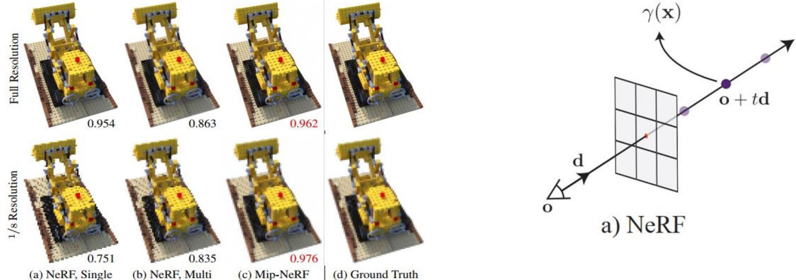
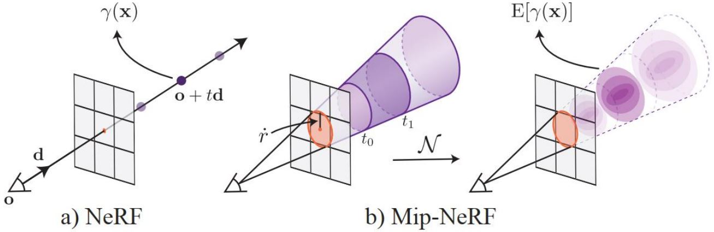

# Mip-NeRF

## 4.1 混叠与抗混叠

### 4.1.1 采样与混叠

**奈奎斯特准则**: 假设信号的最大频率为$$B$$，信号的采样频率为$$f_s$$，则奈奎斯特率（Nyquist rate）为$$2B$$，奈奎斯特准则是$$f_s \gt 2B$$时原始信号采样后不会丢失信息。
<b><font color="#00B050">混叠</font></b>：当采样频率设置不合理时，即采样频率$$f_s$$低于2倍的信号频率（$$f_s \lt 2B$$），会导致原本的高频信号被采样成低频信号。这种频谱的重叠导致的失真称为混叠，也就是高频信号被混叠成了低频信号。

<figure></figure>

<figure>
    
    <figcaption>图像中的混叠现象</figcaption>
</figure>

### 4.1.2 抗混叠

* **增加采样频率**：提高采样频率可以使信号频率𝐵不会超过采样频率$$f_s$$的一半，从而避免混叠的发生。
* **使用低通滤波器**：将信号通过低通滤波器，可以去除信号中高于采样频率一半的频率分量，从而避免混叠。

**抗混叠——低通滤波器**  
&emsp;&emsp;**现象**：出现摩尔纹  
&emsp;&emsp;**原因**：采样频率过低  
&emsp;&emsp;**解决方案**：采样之前，使用低通滤波器去除高于采样频率一半的频率分量。

<figure></figure>

<figure></figure>

## 4.2 NeRF的混叠问题

**现 象**：原始NeRF的模型，在摄像机往远离物体方向移动时，渲染结果存在混叠。  
**原 因**：采样频率过低。  
**解决方案**：超采样？  低通滤波器？（MipMap方案）

<figure></figure>

```note
为什么增加多分辨率样本无法解决混叠问题？  
当摄像机往远离物体方向移动时，同一个像素要包含更大区域的内容，但在同一条光路上神经网络只能输出一个值。
```

## 4.3 Mip-NeRF思想

<figure>
    
    <figcaption>使用圆锥体取代光线，NeRF一条射线对应Mip-NeRF一个圆锥体，NeRF一个采样点对应Mip-NeRF一个圆锥截台</figcaption>
</figure>

### 4.3.1 圆锥台近似计算

圆锥台采样：若$$\mathbf{x}$$位于由相机位置$$\mathbf{o}$$、视线方向$$\mathbf{d}$$、圆台半径$$\dot{r}$$、以及圆台深度区间$$[t_0, t_1]$$定义的圆台中，定义$$F(\mathbf{x}, \cdot) = 1$$，

$$  F(\mathbf{x}, \mathbf{o}, \mathbf{d}, \dot{r}, t_0, t_1)
 =  1 \left\{   \left( t_0 \lt \frac{\mathbf{d}^T (\mathbf{x}-\mathbf{o})}{\|\mathbf{d}\|_2^2} \lt t_1 \right) 
         \wedge \left( \frac{\mathbf{d}^T(\mathbf{x}-\mathbf{o})}{\|\mathbf{d}\|_2\|\mathbf{x}-\mathbf{o}\|_2} \lt \frac{1}{\sqrt{1+(\dot{r} /\|\mathbf{d}\|_2)^2}} \right)
      \right\}
$$

圆锥台位置编码的期望可以定义为

$$  \gamma^* \left(\mathbf{o}, \mathbf{d}, \dot{r}, t_0, t_1\right)
  = \frac{\int \gamma(\mathbf{x}) F(\mathbf{x}, \mathbf{o}, \mathbf{d}, \dot{r}, t_0, t_1) d x}
        {\int F(\mathbf{x}, \mathbf{o}, \mathbf{d}, \dot{r}, t_0, t_1) d x}
$$


### 4.3.2 集成位置编码

## 4.4  Mip-NeRF与NeRF


<!-- 蓝 -->
<b><font color="#3399ff"></font></b>
<!-- 绿 --><!-- #33cc00 -->
<b><font color="#00B050"></font></b>
<!-- 橙 -->
<b><font color="#FF4500"></font></b>